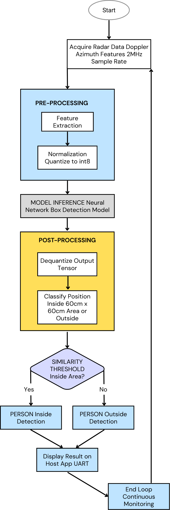

# Radar Box Application for PSoC™ 6

This code example demonstrates how to deploy the Radar Box Application on the PSoC™ 6 MCU. The application uses radar sensor data (Doppler and Azimuth features at 2 MHz sample rate) to detect whether a person is inside or outside a configurable 60 cm x 60 cm area via neural network inference. It enables real-time, contactless monitoring optimized for edge devices like the PSoC™ 6 AI Evaluation Kit.

## Overview
The Radar Box Application is a cutting-edge Edge AI application designed to detect whether a person is located within or outside a predefined 60 cm x 60 cm area using radar sensor data. Leveraging advanced neural network technology, this application provides accurate and real-time inference for contactless monitoring. With configurable area settings, it offers flexibility to adapt to various use cases, making it an ideal solution for consumer electronics manufacturers aiming to integrate intelligent, future-proof functionalities into their products.

### Key Features
- **Radar-Based Detection**: Utilizes radar sensor data to accurately determine whether a person is inside or outside a defined area.
- **Configurable Area**: Default detection area of 60 cm x 60 cm, with customizable dimensions to suit specific application needs.
- **Neural Network Inference**: Employs a robust neural network model for precise and reliable detection in real-time.
- **Edge AI Integration**: Fully optimized for edge devices, ensuring low latency and efficient performance.
- **Contactless Operation**: Enables seamless, non-intrusive monitoring for enhanced user experience.

### Key Benefits
- **Simplified Development**: Pre-trained and tested Edge AI model reduces development time, allowing manufacturers to focus on product innovation.
- **High Accuracy**: Reliable detection across various environmental conditions and user scenarios.
- **Flexible Integration**: Configurable area settings enable easy adaptation to diverse applications and device requirements.
- **Future-Proof Design**: Machine learning-based approach ensures scalability and adaptability in competitive consumer markets.
- **Efficient Performance**: Optimized for low resource consumption, making it suitable for resource-constrained edge devices.

### Key Use Cases
- **Smart Home Devices**: Enhances home automation systems by detecting presence in specific zones for automated lighting, security, or appliance control.
- **Retail Analytics**: Monitors customer presence in designated areas for foot traffic analysis or personalized marketing.
- **Healthcare Monitoring**: Enables contactless patient monitoring in confined spaces, such as hospital beds or recovery areas.
- **Industrial Safety**: Detects personnel in restricted or hazardous zones to ensure compliance with safety protocols.
- **Gaming and Interactive Systems**: Provides intuitive, contactless control for immersive user experiences in gaming or interactive displays.

### Specification and Compatibility
#### Sensor Settings – Radar
- **Sample Rate**: 2000000 Hz
- **Features**: Doppler, Azimuth

#### Supported Devices
- Infineon PSoC™ 6
- Infineon XENSIV™ BGT60TR13C

## Licenses

This sample application and deployable binaries are licensed under the terms in the LICENSE file.  
See: [LICENSE](license/license.txt) for full details.

### High-Level Flow Diagram

## Pre-requisites

1. Install **ModusToolbox™ Programmer** on your computer.
2. Connect the PSoC™ 6 AI Kit to your system via USB.
3. Ensure a working USB/UART connection for programming and visualization.

### Deployment Steps
1. Download all required Box_application_hex.hex, Radar_Box_Application.exe, and the _internal folder from the PSOC6_AI_binaries (PSOC6_AI_fw_binaries/) directory.
 
2. Open ModusToolbox Programmer and load the required Box_application_hex.hex file.
 
3. Configure the programmer settings:
 
	Programmer: KitProg3 CMSIS-DAP
 
	Board: CY8CKIT-062S2-AI
 
4. Click Connect, then click Program to flash the firmware.
 
5. After programming is complete, disconnect the board and press the reset button on the kit.
 
6. For real-time visualization, run Radar_Box_Appliation.exe from the [PSOC6_AI_binaries](PSOC6_AI_fw_binaries/) directory.
Connect to the appropriate serial port (e.g., COM3) to view the dashboard UI.

### Pre-Built Binaries
Pre-built binaries are available in the [PSOC6_AI_binaries](PSOC6_AI_fw_binaries/) directory:
- `Box_application_hex.hex` - Firmware binary that can be directly flashed onto PSoC™ 6 MCU using ModusToolbox™ Programmer tool
- `Radar_Box_Application.exe` - Windows application for real-time counter display and visualization
 
For detailed flashing instructions, refer to [**ModusToolbox™ Programmer Documentation**](https://www.infineon.com/row/public/documents/30/44/infineon-modustoolbox-gui-user-guide-usermanual-en.pdf). Connect via serial port (e.g., COM3) post-flash for output visualization.

---------------------------------------------------------
## Copyrights
 
© 2025 WG Tech Solutions Pvt Ltd. All rights reserved.
 
This project is licensed under the MIT License - see the [LICENSE](license/license.txt) file for details.
 
PSoC™, ModusToolbox™, and XENSIV™ are trademarks of Infineon Technologies AG. Other names and brands may be claimed as property of their respective owners.
