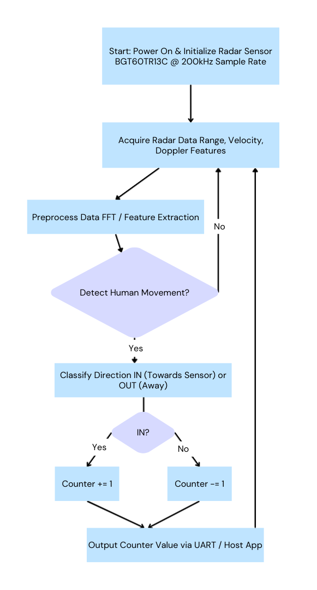
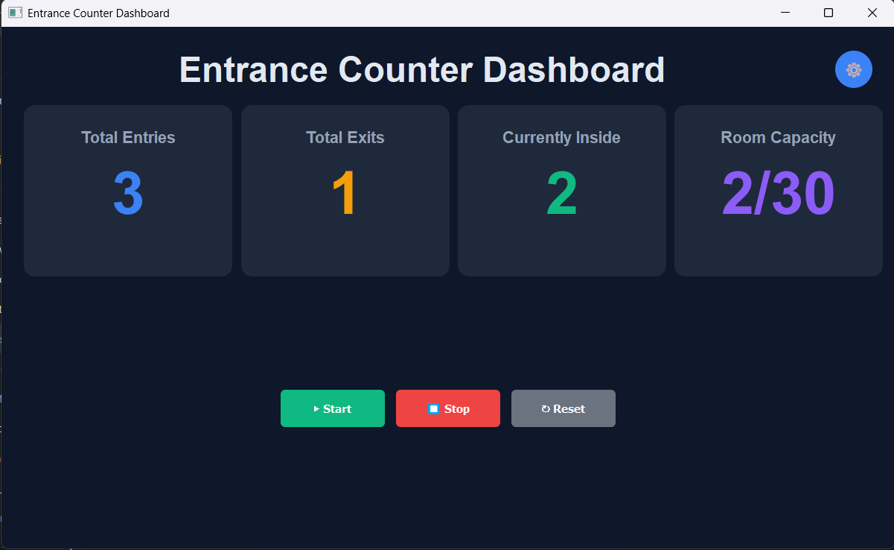

# Radar Entrance Counter Application - PSoC™ 6 Infineon Radar Sensor
This code example demonstrates how to deploy the Radar Entrance Counter Application on the PSoC™ 6 MCU using Infineon’s XENSIV™ 60GHz radar sensor. The application accurately counts people entering (IN) and exiting (OUT) a designated area by detecting and classifying human movement in real-time. It leverages radar-based features like range, velocity, and Doppler for robust, privacy-preserving occupancy monitoring on low-power edge devices.
## Overview
The Application for Radar Entrance Counter is designed to accurately count the number of people entering and exiting a room or designated area. Leveraging Infineon’s XENSIV™ 60 GHz radar sensor and optimized for low-power edge devices, this model enables real-time people counting for applications such as smart buildings, retail stores, offices, and public spaces. It provides a robust, privacy-preserving solution by processing data locally without cloud dependency, reducing development time and expertise needed for deployment.
### Key Features
- **Accurate People Counting**: Detects and classifies human movement to increment a counter when a person enters (IN) and decrement when a person exits (OUT) a room area.
- **Radar-Based Detection**: Utilizes Infineon’s XENSIV™ 60GHz radar sensor for high-precision detection of human presence and direction, robust against environmental variations like lighting or temperature.
- **Low Resource Usage**: Optimized for low memory footprint and fast inference time, ideal for resource-constrained embedded systems such as PSoC™ 6, PSoC™ Edge microcontrollers.
- **Privacy-Focused**: Processes all data locally on the edge device, ensuring no personal data is sent to the cloud.
- **Easy Integration**: Seamlessly integrates with Infineon’s ModusToolbox™ software and supported hardware kits.
- **Versatile Applications**: Suitable for smart buildings, retail occupancy monitoring, conference room management, and restroom availability tracking.
### Use Cases
- **Smart Buildings**: Monitor occupancy in meeting rooms or offices to optimize space usage and prevent overcrowding.
- **Retail Stores**: Track customer foot traffic to analyze peak hours and manage store capacity.
- **Public Facilities**: Indicate restroom or venue availability by displaying real-time occupancy status.
- **Safety and Compliance**: Ensure adherence to occupancy limits in restaurants, theatres, or other public spaces.
### Specification and Compatibility
#### Sensor Settings – Radar

- **Sample Rate**: 200000 Hz
- **Field of View**: ±45 degrees
- **Features**: Range, velocity, Doppler
#### Supported Devices
- Infineon PSoC™ 6
- Infineon XENSIV™ BGT60TR13C
## Licenses

This sample application and deployable binaries are licensed under the terms in the LICENSE file.  
See: [LICENSE](licenses/LICENSE) for full details.

All Infineon product names and trademarks (PSoC™, ModusToolbox™, XENSIV™, etc.) are property of Infineon Technologies AG.
### High-Level Flow Diagram

## Pre-requisites

1. Setup ModusToolbox™ software environment and supported hardware kit (e.g., PSoC™ 6 with XENSIV™ BGT60TR13C radar sensor). Refer to the [ModusToolbox™ User Guide](https://www.infineon.com/cms/en/design-support/tools/sdk/modustoolbox-software/) for installation and kit configuration.

2. Install necessary libraries via ModusToolbox Library Manager (e.g., Radar Sensing SDK).

3. This code example assumes UART/USB connection for output visualization; optional host app for GUI display (e.g., Python-based counter viewer).

### Deployment Steps
1. Download all required .hex and .exe files from the PSOC6_AI_fw_binary folder.
 
2. Open ModusToolbox Programmer and load the required .hex file.
 
3. Configure the programmer settings:
 
	Programmer: KitProg3 CMSIS-DAP
 
	Board: CY8CKIT-062S2-AI
 
4. Click Connect, then click Program to flash the firmware.
 
5. After programming is complete, click Disconnect in the Programmer and press the reset button on the kit.
 
6. For real-time visualization, run Dashboard.exe from the PSOC6_AI_fw_binary directory.

Connect to the appropriate serial port (e.g., COM3) to view the dashboard UI.

 
### Pre-Built Binaries
Pre-built binaries are available in the [PSOC6_AI_binaries](PSOC6_AI_fw_binary/) directory:
- `Entrance_counter.hex` - Firmware binary that can be directly flashed onto PSoC™ 6 MCU using ModusToolbox™ Programmer tool
- `Dashboard.exe` - Windows application for real-time counter display and visualization
 
For detailed flashing instructions, refer to [**ModusToolbox™ Programmer Documentation**](https://www.infineon.com/row/public/documents/30/44/infineon-modustoolbox-gui-user-guide-usermanual-en.pdf). Connect via serial port (e.g., COM3) post-flash for output visualization.
 
---
 
## Copyrights
 
© 2025 WG Tech Solutions Pvt Ltd. All rights reserved.
 
This project is licensed under the MIT License - see the [LICENSE](licenses/LICENSE) file for details.
 
PSoC™, ModusToolbox™, and XENSIV™ are trademarks of Infineon Technologies AG. Other names and brands may be claimed as property of their respective owners.
