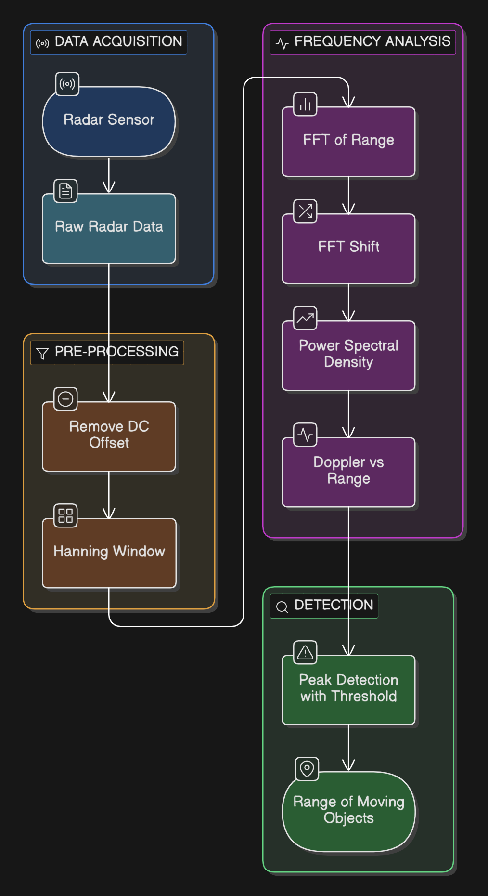
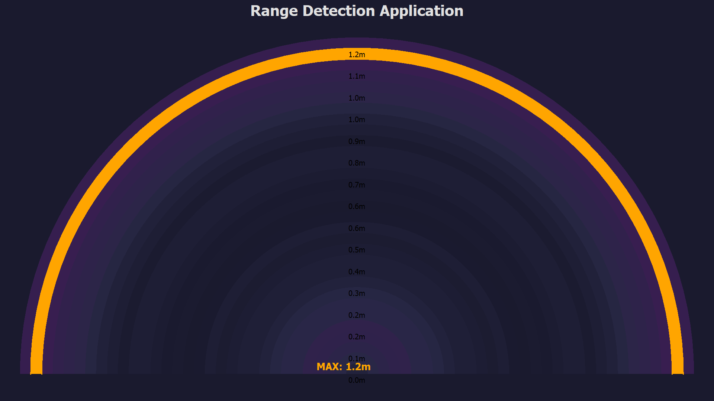

---

# Range Detection Application for PSoC™ 6

This code example demonstrates how to deploy the **Range Detection application** on the **PSoC™ 6 MCU** using **Infineon’s XENSIV™ 60 GHz radar sensor**. The application detects objects and estimates their distance **within a predefined range** by processing FMCW radar signals in real time. It leverages radar-based signal processing techniques such as FFT, Doppler analysis, and power spectral density computation to enable accurate, privacy-preserving range sensing on low-power edge devices.

---

## Overview

The **Range Detection Application** is designed to detect objects and estimate their distance from the radar sensor within a configurable predefined range. Leveraging Infineon’s XENSIV™ 60 GHz radar sensor and optimized for low-power edge devices, this application performs complete radar signal processing locally on the PSoC™ 6 MCU.

By converting raw ADC samples into Doppler–Range representations, the application enables robust and low-latency distance estimation without any cloud dependency, reducing development complexity and improving deployment efficiency for embedded radar-based systems.

---

### Key Features

* **Predefined Range Detection**: Detects objects and estimates their distance within a configurable predefined range.
* **Radar-Based Sensing**: Utilizes Infineon’s XENSIV™ 60 GHz radar sensor for accurate distance estimation, robust against lighting, dust, and temperature variations.
* **End-to-End Signal Processing**: Includes ADC acquisition, windowing, FFT processing, Doppler analysis, and range estimation.
* **Low Resource Usage**: Optimized for embedded deployment on PSoC™ 6 microcontrollers.
* **Privacy-Focused**: Radar-only sensing with all data processed locally on the edge device.
* **Easy Integration**: Seamlessly integrates with Infineon’s ModusToolbox™ software and supported hardware kits.

---

### Use Cases

* **Industrial Automation**: Distance monitoring and object detection within defined safety zones.
* **Smart Infrastructure**: Range-based detection for access control, parking, and gate automation.
* **Robotics & Drones**: Obstacle distance estimation within a configured operational range.
* **Safety Systems**: Trigger alerts or actions when objects appear within a predefined distance.

---

### Specification and Compatibility

#### Sensor Settings – Radar

* **Sample Rate**: 200000 Hz
* **Field of View**: ±45 degrees
* **Radar Type**: FMCW 60 GHz
* **Features**: Range estimation, Doppler processing

#### Supported Devices

* Infineon **PSoC™ 6**
* Infineon **XENSIV™ BGT60TR13C**

---

## Licenses

This sample application and deployable binaries are licensed under the terms in the **LICENSE** file.
See: [LICENSE](licenses/LICENSE) for full details.

All Infineon product names and trademarks (PSoC™, ModusToolbox™, XENSIV™, etc.) are property of Infineon Technologies AG.

---

### High-Level Flow Diagram

---

## Pre-requisites

1. Install **ModusToolbox™ Programmer** on your computer.
2. Connect the PSoC™ 6 AI Kit to your system via USB.
3. Ensure a working USB/UART connection for programming and visualization.

---

### Deployment Steps

1. Download all required .hex and .exe files from the [PSOC6_AI_binaries](PSOC6_AI_fw_binary) folder.
 
2. Open ModusToolbox Programmer and load the required Range_Detection_hex.hex file.
 
3. Configure the programmer settings:
 
	Programmer: KitProg3 CMSIS-DAP
 
	Board: CY8CKIT-062S2-AI
 
4. Click Connect, then click Program to flash the firmware.
 
5. After programming is complete, disconnect the board and press the reset button on the kit.
 
6. For real-time visualization, run Radar_Range_Application.exe from the PSOC6_AI_fw_binary directory.
Connect to the appropriate serial port (e.g., COM3) to view the dashboard UI.

---

### Pre-Built Binaries

Pre-built binaries are available in the [PSOC6_AI_binaries](PSOC6_AI_fw_binary/) directory:

* `Range_Detection_hex.hex` – Firmware binary that can be directly flashed onto the PSoC™ 6 MCU using ModusToolbox™ Programmer
* `Radar_Range_Application.exe` – Windows application for real-time range visualization

For detailed flashing instructions, refer to
[**ModusToolbox™ Programmer Documentation**](https://www.infineon.com/row/public/documents/30/44/infineon-modustoolbox-gui-user-guide-usermanual-en.pdf).
Connect via the serial port (e.g., COM3) after flashing for output visualization.

---

## Copyrights

© 2025 **WG Tech Solutions Pvt Ltd**. All rights reserved.

This project is licensed under the **MIT License** – see the [LICENSE](licenses/LICENSE) file for details.

PSoC™, ModusToolbox™, and XENSIV™ are trademarks of Infineon Technologies AG. Other names and brands may be claimed as property of their respective owners.

---

